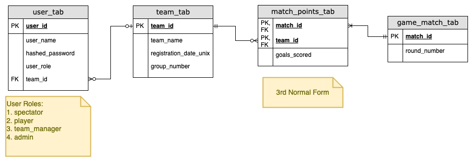

# Database Design



``` sql
CREATE TABLE IF NOT EXISTS user_tab (
    user_id BIGINT UNSIGNED AUTO_INCREMENT PRIMARY KEY, 
    -- unknown number of players and spectators per team
    -- whole of Singapore population may spectate
    user_name VARCHAR(50) NOT NULL,
    hashed_password VARCHAR(72) NOT NULL, 
    -- bcrypt max bytes: 72
    user_role ENUM('viewer', 'player', 'manager','admin') NOT NULL,
    team_id TINYINT UNSIGNED 
    -- only 12 teams in scenario < 255
    -- nullable if not player or manager
) ENGINE=InnoDB CHARACTER SET utf8;

CREATE INDEX idx_user_name
ON user_tab(user_name);

CREATE TABLE IF NOT EXISTS team_tab (
    team_id TINYINT UNSIGNED PRIMARY KEY,
    -- only 12 teams in scenario < 255
    team_name VARCHAR(50) NOT NULL,
    registration_date_unix BIGINT UNSIGNED NOT NULL,
    group_number TINYINT UNSIGNED NOT NULL
) ENGINE=InnoDB CHARACTER SET utf8;

CREATE TABLE IF NOT EXISTS game_match_tab (
    match_id BIGINT UNSIGNED PRIMARY KEY,
    round_number TINYINT UNSIGNED NOT NULL
    -- 3 rounds: round of 6 each, round of 4 each, final 2
) ENGINE=InnoDB CHARACTER SET utf8;

CREATE INDEX idx_round_number
ON game_match_tab(round_number);

CREATE TABLE IF NOT EXISTS match_points_tab (
    match_id BIGINT UNSIGNED,
    team_id TINYINT UNSIGNED,
    PRIMARY KEY (match_id, team_id),
    FOREIGN KEY (match_id) REFERENCES game_match_tab(match_id) ON DELETE CASCADE,
    FOREIGN KEY (team_id) REFERENCES team_tab(team_id),
    -- the matches associate with team have to be deleted first before the team can be deleted
    goals_scored TINYINT UNSIGNED NOT NULL,
    -- average goals in tournaments like Fifa world cup
    -- don't crack more than 8 goals on average
    -- https://www.statista.com/statistics/269031/goals-scored-per-game-at-the-fifa-world-cup-since-1930/
) ENGINE=InnoDB CHARACTER SET utf8;
```
